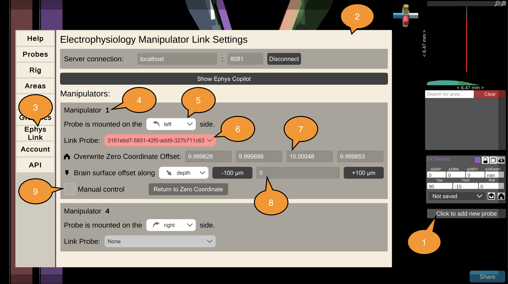

# Tutorial

Press [H] at any time to open the help and settings menu.

  <iframe src="https://www.youtube-nocookie.com/embed/uzKulUziWFI?rel=0&modestbranding=1" style="position: absolute; top: 0; left: 0; width: 100%; height: 100%; border:0;" allowfullscreen title="Overview"></iframe>

 

## Overview

<image src="../_static/images/tutorial/overview.png" alt="overview image" position="left" style="width:100%">

Pinpoint presents you with an interactive 3D scene where you can plan and test different probe insertion trajectories. The scene view shows the mouse brain **(1)** composed of 3D models built from the Allen Common Coordinate Framework annotations and **(2)** the probe 3D model, showing in white the active recording region. The scene view and probe can be rotated and moved by clicking and dragging with your mouse, see the section titled *Controls*, below. **(3)** The rotation gizmo helps you understand the orientation of the brain, with Yellow representing the Dorsal-Ventral axis, Red the Anterior-Posterior axis, and blue the Left-Right (or Medial-Lateral) axis. Double-clicking the gizmo will snap the camera view to the corresponding planar view (i.e. Axial, Coronal, and Sagittal).

Pinpoint interpolates the recording region on the probe in two viewports to help you understand where your electrodes are placed in the brain. The probe UI **(4)** shows you a linear interpolation through the recording region. The in-plane slice **(5)** shows you a view of not only the probe but also the surrounding regions. You can click regions in the in-plane slice to highlight them in the 3D scene. You can also highlight regions of interest by searching for them in the search panel **(6)**. Click a region turns it on and off and pressing the *Clear* button removes all highlighted regions. The *snap-to-area* button (downward arrrow) moves the probe tip to the center of that region.

To set up a new probe, select the corresponding button the new probe panel **(7)**. By default, probes are spawned at Bregma. You can change the reference coordinate in the *Atlas* settings. When you have multiple probes in the scene you can click on the probe objects to switch the *active* probe, or you can click on the probe panels on the left side of the screen.

The coordinates of a probe are shown in the last panel **(8)** and can be copied to the clipboard using the download icon at the top right. When the probe is outside of the brain we display the tip coordinate and angles. When the probe is inside the brain Pinpoint computes for you the *brain surface coordinate* and *depth* of the probe, which are the coordinates you would need to re-create an insertion. See the surgery section for a few important details.

## Camera controls

  <iframe src="https://www.youtube-nocookie.com/embed/Lj7YQGq4NWE?rel=0&modestbranding=1" style="position: absolute; top: 0; left: 0; width: 100%; height: 100%; border:0;" allowfullscreen title="Overview"></iframe>

 

## Probe controls

  <iframe src="https://www.youtube-nocookie.com/embed/-W7r9d5SKzM?rel=0&modestbranding=1" style="position: absolute; top: 0; left: 0; width: 100%; height: 100%; border:0;" allowfullscreen title="Overview"></iframe>

 

### Click + Drag

To control your probe left-click on the probe object. While holding the left mouse button press one of the axis keys and drag the probe in space to move the probe along that axis. The axis keys are [W/S] for AP, [A/D] for ML, [Q/E] for DV, and [Z/X] for depth.

<image src="../_static/images/tutorial/controls.png" alt="overview image" position="left" style="width:100%">

### Keyboard

You can also press the keyboard keys to move the probe along that axis in 10um units. Hold **SHIFT** to move in 100um units. Hold **CTRL** to move in 1um units. Pressing and holding a key moves continuously.

Use [W/A/S/D] to move the probe along the AP or ML axis. Use [Z/X] to move the probe along the DV axis.

USe [Q/E] to rotate the probe azimuth, which corresponds to the angle of the probe manipulator relative to the brain.

Use [R/F] to change the angle of the probe on the manipulator (restricted to 0-90 deg range).

Use [1/3] to spin the probe along the axis of the probe shank. Note that NP2.4 probes spin around the leftmost probe shank when looking from the back.

Probes can be deleted with [Backspace]. To recover a probe you didn't mean to delete press [CTRL + Backspace].

### Recording region

Once the probe is at the position and angles you want, you can adjust the recording region size (in the settings) and position (using [T/G]) to match what you plan to do in your recording and adjust the insertion depth accordingly.

## Designing a trajectory and probe coordinates

  <iframe src="https://www.youtube-nocookie.com/embed/T1ZVcbwLCVw?rel=0&modestbranding=1" style="position: absolute; top: 0; left: 0; width: 100%; height: 100%; border:0;" allowfullscreen title="Overview"></iframe>

 

### Probe coordinates

A probe **insertion** is defined by a target coordinate in the brain and a set of angles to reach that point. When you export a planned insertion Pinpoint will compute the **brain surface coordinate** and **depth** of the probe, which you will need to actually perform your experiment. 

Note that insertions are defined in a Coordinate **Space** with a particular **Transform**. The space defines the rotation of the axes relative to the reference point (i.e. which way do AP/ML/DV go relative to Bregma). By default all insertions in Pinpoint are defined in the common coordinate framework space, using the IBL axis conventions, these can be changed in the settings. The standard transform is the *Toronto MRI* transform, which was based on the average of 12 adult C57 mice. You can read more about the transform options on the [in vivo alignment](https://virtualbrainlab.org/02_traj_planner/03_tp_alignment.html) page.

## Help and settings

<image src="../_static/images/tutorial/help.png" alt="overview image" position="left" style="width:100%">

The help and settings menu is accessed by pressing **H**. Press H again to close the window. The tabs **(1)** on the left side switch between the different sub-menus.

 
### Rig components

  <iframe src="https://www.youtube-nocookie.com/embed/pcwMFFWdbG4?rel=0&modestbranding=1" style="position: absolute; top: 0; left: 0; width: 100%; height: 100%; border:0;" allowfullscreen title="Overview"></iframe>

 

### Areas & Atlas options

  <iframe src="https://www.youtube-nocookie.com/embed/qLoy63HSswA?rel=0&modestbranding=1" style="position: absolute; top: 0; left: 0; width: 100%; height: 100%; border:0;" allowfullscreen title="Overview"></iframe>

 
 

## Ephys Link

Pinpoint can be connected to Sensapex manipulators enabling experimenters to automate the placement of manipulators as well as observe live where probes are placed inside the mouse brain.

To enable this feature, an instance of an Ephys Link server must be running on the local network. Please see the instructions [here](https://virtualbrainlab.org/05_misc/03_ephys_link.html#installation) on how to install and run a server.  

  <iframe src="https://www.youtube-nocookie.com/embed/MxotxcZ0f4U?rel=0&modestbranding=1" style="position: absolute; top: 0; left: 0; width: 100%; height: 100%; border:0;" allowfullscreen title="Overview"></iframe>

 

### Connecting to a server

1. Press \[H\] to open the settings menu
2. Switch to the "Ephys Link" tab
3. Fill in the server's IP address
4. And the port number
5. Click "Connect". Upon success, the connect button will read "Disconnect"
6. Manipulators by default spawn as "left-handed". Use the drop-down menu to change the handedness of each detected manipulator.
 1. Handedness determines the orientation of the manipulator and which direction it moves. Handedness is determined by which side of the manipulator the probe will be mounted on.
 2. Example of a left-handed manipulator: 
 3. Example of a right-handed manipulator: 
7. Press \[H\] again to close the settings menu

### Linking a probe in the planner to a manipulator in real life

1. Spawn the corresponding probe (NP 1.0/2.0/2.4) in the planner scene
2. Press \[H\] to open the settings menu
3. Switch to the "Ephys Link" tab
4. Using the dropdown for each probe, select the desired manipulator to connect to. Only manipulators that are connected to the server will be listed.
5. Upon connection, the probe's stereotaxic position will be used as the zero coordinate all movements will be relative to. This zero position can be edited manually through the text boxes or by clicking the home button to reset the position to the current probe position.
6. The probe's offset from the brain surface and which direction it is calculated can be adjusted here. The offset is the distance from the probe tip to the brain surface. This offset can be determined as the distance from the tip to the brain surface along the DV axis or the probe's depth axis.

### Quick settings

Quick settings for the active probe are found at the bottom of the right-hand panel stack. There, a manipulator's position, angles, zero coordinate, and offset from the brain can be set.

- Use the text boxes to edit and position and angles of the probe.
- Use the down arrow button to set the offset from the brain surface and drop the probe to the brain surface.
- Use the home button to reset the probe's position to the current probe position.

## Account

Coming soon...

## Surgery

To use your coordinates for a surgery, rotate the manipulator to match the azimuth angle (phi) and set the probe elevation angle (theta). Then move your probe tip to Bregma and zero your manipulator.

Translate your probe using the manipulator to match the AP/ML/DV brain surface coordinate provided by Pinpoint. If your probe is rotated off-axis use the *convert AP/ML to probe axis* setting so that you can match the Forward/Side/DV position instead. Use caution! You may reach the brain surface before you reach the DV value specified by Pinpoint, don't break your probe!

Once the probe is touching the dura, zero the depth axis and insert until you reach the specified depth.

