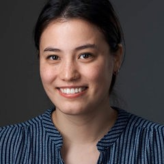
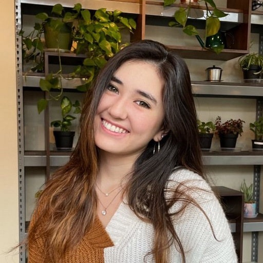

# About

The VBL develops tools for [experimenting](../pinpoint/installation_and_use.md) with and [exploring](../urchin/installation_and_use.md) brains.

Please see the individual projects for installation instructions and documentation. You can find all our code on [Github](https://github.com/VirtualBrainLab).

## Team

### Core Developers

<image src="../_static/people/dan.jpg" alt="Dan" position="left" style="border-radius: 8px;width:20vh">

**[Daniel Birman, PhD](https://danbirman.com)**

Washington Research Foundation Postdoctoral Fellow

Dan maintains the core tools in the VBL.

<image src="../_static/people/kenneth.jpg" alt="Kenneth" position="left" style="border-radius: 8px;width:20vh">

**[Kenneth Yang](https://www.linkedin.com/in/kenneth-yang-816027219/)**

Undergraduate Researcher (Mary Gates Scholar, UW 2025)

Kenneth maintains ephys-link and the Pinpoint automation stack.

<image src="../_static/people/jasmine.jpg" alt="Jasmine" position="left" style="border-radius: 8px;width:20vh">

<!-- **Jasmine Schoch**

Undergraduate Researcher (SURFiN Fellow, UW 2025)

Jasmine is piloting new educational tools, which we are hoping to roll out in 2023. -->

<!-- <image src="../_static/people/selina.png" alt="Selina" position="left" style="border-radius: 8px;width:20vh">

**Selina Li**

Undergraduate Researcher (UM 2024)

Selina is piloting new 2-photon integrations in Urchin. -->

***

### Collaborators

    <!-- first row-->
    

        
        
Mayo Faulkner, PhD

        
UX Engineer - IBL

    

    

        
        
Cyrille Rossant, PhD

        
Scientific Programmer - IBL

    

    

        
        
Yoni Browning, PhD

        
Scientist - Allen Institute

    

    <!-- second row-->
    <!-- 

        
        
Mayo Faulkner, PhD

        
UX Engineer - IBL

    

    

        
        
Cyrille Rossant, PhD

        
Scientific Programmer - IBL

    

    

        
        
Alice Johnson

        
Position: Engineer

    
 -->

***

### Past Developers

    <!-- first row-->
    

        
        
Kai Nylund

        
Undergraduate Researcher

    

    

        
        
Qiqi Liang

        
Undergraduate Researcher

    

    

        
        
Selina Li

        
Undergraduate Researcher

    

    <!-- second row-->
    

        
        
Jasmine Schoch

        
Undergraduate Researcher

    

    <!-- 

        
        
Kenneth Yang

        
Undergraduate Reseearcher

    
 -->
    <!-- 

        
        
Alice Johnson

        
Position: Engineer

    
 -->

 ***

## Funding

The VBL is funded indirectly by generous grants from the Washington Research Foundation, National Science Foundation, Simons Collaboration for the Global Brain, and the Wellcome Trust.
