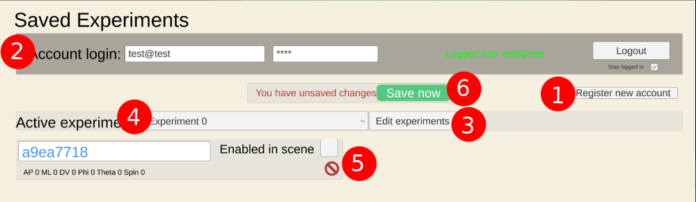

# Trajectory Planning

Press [ESC] at any time to open the help and settings menu.

  <iframe src="https://www.youtube-nocookie.com/embed/uzKulUziWFI?rel=0&modestbranding=1" style="position: absolute; top: 0; left: 0; width: 100%; height: 100%; border:0;" allowfullscreen title="Overview"></iframe>

 

## Plan an insertion in six minutes

If you want the quick introduction to Pinpoint, this video will get you all the critical
information for planning your first recording. The rest of the tutorial sections go deeper
into each topic and explain some of the hidden settings that you can tweak to make Pinpoint work for your
specific use case.

  <iframe src="https://www.youtube-nocookie.com/embed/htTz5tUpCwo?rel=0&modestbranding=1" style="position: absolute; top: 0; left: 0; width: 100%; height: 100%; border:0;" allowfullscreen title="Overview"></iframe>

 

## Overview

<image src="../../_static/images/tutorial/overview.png" alt="overview image" position="left" style="width:100%">

Pinpoint presents you with an interactive 3D scene where you can plan and test
different probe insertion trajectories. The scene view shows the mouse brain **(1)** composed of 3D models built from the Allen Common Coordinate Framework annotations and **(2)** the probe 3D model, showing in white the active recording region. The scene view and probe can be rotated and moved by clicking
and dragging with your mouse, see the section titled *Controls*, below. **(3)**
The rotation gizmo helps you understand the orientation of the brain, with
Yellow representing the Dorsal-Ventral axis, Red the Anterior-Posterior axis,
and blue the Left-Right (or Medial-Lateral) axis. Double-clicking the gizmo will
snap the camera view to the corresponding planar view (i.e. Axial, Coronal, and
Sagittal).

Pinpoint interpolates the recording region on the probe in two viewports to help
you understand where your electrodes are placed in the brain. The probe UI **(
4)** shows you a linear interpolation through the recording region. The in-plane
slice **(5)** shows you a view of not only the probe but also the surrounding
regions. You can click regions in the in-plane slice to highlight them in the 3D
scene. You can also highlight regions of interest by searching for them in the
search panel **(6)**. Click a region turns it on and off and pressing the *
Clear* button removes all highlighted regions. The *snap-to-area* button (
downward arrrow) moves the probe tip to the center of that region.

To set up a new probe, select the corresponding button the new probe panel **(
7)**. By default, probes are spawned at Bregma. You can change the reference
coordinate in the *Atlas* settings. When you have multiple probes in the scene
you can click on the probe objects to switch the *active* probe, or you can
click on the probe panels on the left side of the screen.

The coordinates of a probe are shown in the last panel **(8)** and can be copied
to the clipboard using the download icon at the top right. When the probe is
outside of the brain we display the tip coordinate and angles. When the probe is
inside the brain Pinpoint computes for you the *brain surface coordinate* and *
depth* of the probe, which are the coordinates you would need to re-create an
insertion. See the surgery section for a few important details.

### Probe panel

<image src="../../_static/images/tutorial/quick_settings.png" alt="overview image" position="left" style="width:50%">

The Probe panel provides easy access to the information about the active probe in the scene. Using the panel you can tweak the entry coordinate by changing the AP/ML/DV position data or change the insertion depth. You can also adjust the insertion angles. 

The three buttons on the top right **lock** the probe (preventing accidental keyboard or mouse movements), **duplicate** the probe in the scene, and **download** the probe data to the clipboard. You can paste the copied data into any text editor.

The bottom row has the **Accounts dropdown** where you can choose which experiments this probe is saved in, as well as the **snap to dura** button and **home** button.

The home button moves the probe back to the current reference coordinate (defined in the Atlas settings). The snap to dura button snaps the probe back to the surface of the brain, moving only along the depth axis. 

## Camera controls

  <iframe src="https://www.youtube-nocookie.com/embed/Lj7YQGq4NWE?rel=0&modestbranding=1" style="position: absolute; top: 0; left: 0; width: 100%; height: 100%; border:0;" allowfullscreen title="Overview"></iframe>

 

<image src="../../_static/images/urchin/basic_controls.png" alt="overview image" position="left" style="width:100%">

## Probe controls

  <iframe src="https://www.youtube-nocookie.com/embed/-W7r9d5SKzM?rel=0&modestbranding=1" style="position: absolute; top: 0; left: 0; width: 100%; height: 100%; border:0;" allowfullscreen title="Overview"></iframe>

 

### Click + Drag

To control your probe with mouse clicks and dragging:

1. Left-click and hold on the probe object
2. Press and release any of the axis keys on your keyboard, the axis should become visible in the 3D scene
3. Continue holding the mouse and drag the probe along that axis.

The axis keys are [W/S] for AP, [A/D] for ML, [Q/E] for DV, and [Z/X] for depth. Note that in some views it may be hard to drag along a particular axis (e.g. in the default axial view you can't drag a probe along the DV axis, because the axis is not visible).

<image src="../../_static/images/tutorial/controls.png" alt="overview image" position="left" style="width:100%">

### Keyboard

You can also press the keyboard keys to move the probe along that axis in 1/10/100/1000um
increments. Pressing and holding a key moves continuously.

Press <kbd>SHIFT</kbd> to increase the speed of each movement. Press <kbd>CTRL</kbd> to reduce the speed. 

Use <kbd>W/A/S/D</kbd> to move the probe along the AP or ML axis. Use <kbd>Q/E</kbd> to move the
probe along the DV axis and <kbd>Z/X</kbd> to move the probe along the depth axis.

You can also rotate the probe with keyboard clicks.

Use <kbd>1/3</kbd> to yaw the probe around the vertical axis. Note that NP2.4
probes spin around shank 0 (the leftmost probe shank when looking from the front).

Use <kbd>R/F</kbd> to change the pitch angle of the probe on the manipulator (restricted to
the vertical to horizontal range).

Use <kbd>,/.</kbd> to roll the probe along its own axis.

Probes can be deleted with <kbd>Backspace</kbd>. To recover a probe you didn't mean to
delete press <kbd>CTRL + Backspace</kbd>.

You can also quickly switch between probes in the scene by pressing the <kbd>N</kbd> and <kbd>M</kbd> keys.

### Controller

You can also use a USB controller to move probes.

### Channel map

Once the probe is at the position and angles you want you can change the active set of channels in the Probe menu. The default option is the first bank of electrodes (first 384 channels for Neuropixels 1.0, or the bottom 96 channels on each shank for Neuropixels 2.4). Use the "all" option to see the entire probe at once.

## Designing a trajectory and probe coordinates

  <iframe src="https://www.youtube-nocookie.com/embed/T1ZVcbwLCVw?rel=0&modestbranding=1" style="position: absolute; top: 0; left: 0; width: 100%; height: 100%; border:0;" allowfullscreen title="Overview"></iframe>

 

### Probe coordinates

A probe **insertion** is defined by a target coordinate in the brain and a set
of angles to reach that point. When you export a planned insertion Pinpoint will
compute the **brain surface coordinate** and **depth** of the probe, which you
will need to actually perform your experiment.

Note that insertions are defined in a Coordinate **Space** with a particular **Transform**. The space defines the rotation of the axes relative to the reference point (i.e. which way do AP/ML/DV go relative to Bregma). By default all insertions in Pinpoint are defined in the common coordinate framework space, using the IBL axis conventions, these can be changed in the settings. The standard transform is the *Qiu 2018* transform, which was based on the average of 12 adult C57 mice. You can read more about the transform options on the [in vivo alignment](https://virtualbrainlab.org/02_traj_planner/03_tp_alignment.html) page.

## Settings

<image src="../../_static/images/tutorial/help.png" alt="overview image" position="left" style="width:100%">

The Settings menu is accessed by pressing <kbd>ESC</kbd>. Press ESC again to close
the window. The tabs **(1)** on the left side switch between the different
sub-menus.

### Rig components

  <iframe src="https://www.youtube-nocookie.com/embed/pcwMFFWdbG4?rel=0&modestbranding=1" style="position: absolute; top: 0; left: 0; width: 100%; height: 100%; border:0;" allowfullscreen title="Overview"></iframe>

 

### Areas & Atlas options

  <iframe src="https://www.youtube-nocookie.com/embed/qLoy63HSswA?rel=0&modestbranding=1" style="position: absolute; top: 0; left: 0; width: 100%; height: 100%; border:0;" allowfullscreen title="Overview"></iframe>

 

## Account

The Accounts tab in the settings allows you to save insertions across computers.
Insertions are stored in experiments. One insertion can be shared across
multiple experiments.

1. Register a new account, we kindly ask that you use an email address so that we can keep in touch about major updates to Pinpoint in the future. We won't give away your email or send a message more than once or twice a year.
2. Log in to your account by providing the username and password. Leave the "stay logged in" toggle checked if you are on a private computer.
3. Open the experiment edit panel to add and remove experiments and re-name them. Experiments are just buckets, you can use them in any way you want: to represent mice, to actually represent different experiments, to represent differents sets of insertions targeting particular brain regions, etc.
4. Select the current active experiment from the dropdown. This will change the visible list of insertions below.
5. The insertion list shows the insertions in the active experiment. You can rename insertions, delete them from the experiment, and enable/disable them in the 3D scene. Coming soon: we will add options to mark insertions as "recorded" so that we can calculate coverage maps for experiments.
6. Any time your local data is out-of-sync with the data stored on the server the "unsaved changes" message will appear. If you are using Pinpoint in a browser **please note that unsaved changes do not get saved if you exit the browser**, the program auto-saves changes about once a minute. If you are using Pinpoint in a desktop app, exiting will automatically save all changes.

## Surgery

To use your coordinates for a surgery, rotate the manipulator to match the azimuth angle (phi) and set the probe elevation angle (theta). Then move your probe tip to Bregma and zero your manipulator. (Optional: move your probe tip to Lambda and record the distance from Bregma to Lambda, then enter that into the Atlas settings in Pinpoint). We recommend using the technique shown in  when estimating the position of Bremga and Lambda on the skull (i.e. align the "curve" between the sutures, not the exact point where they attach).

Translate your probe using the manipulator to match the AP/ML/DV brain surface coordinate provided by Pinpoint. If your probe is rotated off-axis use the * convert AP/ML to probe axis* setting so that you can match the Forward/Side/DV position instead. Use caution! You may reach the brain surface before you reach the DV value specified by Pinpoint, don't break your probe!

Once the probe is touching the dura, zero the depth axis and insert until you reach the specified depth.

