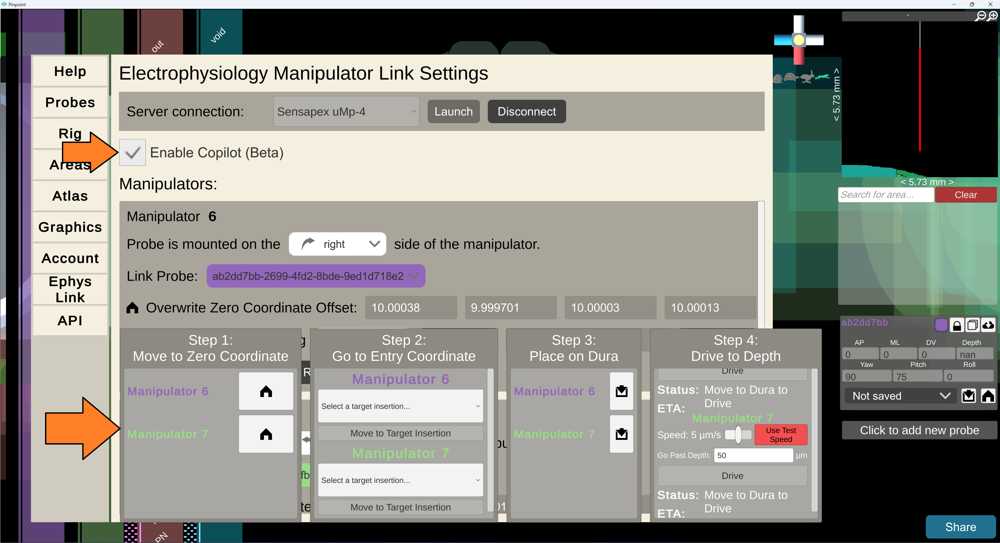

# Automate Experiments with Ephys Copilot

<b>Ephys Copilot is still in Early Beta!</b>

This is an internal document for Steinmetz Lab members to reference.

Please <a href="https://virtualbrainlab.org/about/overview.html">contact</a> Dan or Kenneth if you would like to try it out.

**Overview**

1. Launch Pinpoint
2. Create/load experiment
3. Create dummy probes for visualization
4. Launch Ephys Link
5. Configure manipulators
6. Connect dummy probes to manipulators
7. Activate Copilot
8. Calibrate manipulators to Bregma
9. Drive manipulators to target
10. Calibrate to the Dura
11. Punch through the Dura
12. Drive to target depth
13. Record data
14. Return to the surface
15. Clean up

## 1. Launch Pinpoint

1. Double-click the Pinpoint icon on the desktop to launch the application.

   

2. Wait until you see the brain in the middle of the screen. The app may take a
   while to open if it is updating. You may need to switch to it if other
   windows are in front.

## 2. Create/load experiment

Use the accounts system to log in and load an experiment.

TODO: Add more details once accounts are operational.

## 3. Create dummy probes for visualization

1. Click the "Add new probe" button in the top right corner of the screen:

   

2. Select the type of probe you want to create:

   

3. Set your probe's angles using the text boxes to match your manipulator's
   angles:

   
    1. Angles of 0, 0, 0 represent a probe that is parallel to
       the ground, pointing anteriorly, and probe's circuitry is facing
       dorsally. A pitch of 90 degrees would point the probe straight down.
4. Repeat steps 1 - 3 for each manipulator you will be using.
    1. You can click the colored square to change the color of the probe in the
       scene.
       

## 4. Launch Ephys Link

1. Press <kbd>ESC</kbd> to open the main menu.
2. Switch to the "Ephys Link" tab.
   
3. Set the dropdown to "Sensapex uMp-4" (it should be by default) and press the
   launch button.
   
4. After a few seconds, you will see the Ephys Link window open separately and
   Pinpoint will establish a connection. Leave the Ephys Link window running in
   the background.
5. Your manipulators will appear as separate panels in the Ephys Link window.
   

## 5. Configure manipulators

1. Set the handedness of each manipulator by selecting it from the dropdown.
   
    1. Handedness determines the orientation of the manipulator and which
       direction it moves. Handedness is classified by which side of the
       manipulator the probe will be mounted on. Ephys Link will use this to
       correctly orient the manipulator's direction. Below is a diagram of the
       handedness of Sensapex manipulators. Use this to determine the handedness
       of your manipulator.
       

## 6. Connect dummy probes to manipulators

1. Click the dropdown by "Link Probe" and select the probe you want to link to
   the manipulator.
   

2. Repeat for each manipulator _in vivo_. There should be a 1:1 pairing of
   dummy probes to manipulators.
3. You should end up with something like this:
   

You may notice that the dummy probes do not reflect the same position as your
_in vivo_ manipulators. This is because the manipulators have not been
calibrated to Bregma yet. We will do this in a later part.

## 7. Activate Copilot

1. Press the Enable Copilot Checkbox to activate the Copilot panel. The Copilot
   Panel opens behind the main menu.
     
2. Close the menu by pressing <kbd>ESC</kbd> to see the Copilot panel.
   

## 8. Calibrate manipulators to Bregma

1. **Get up and physically move** to your manipulators.
2. **Manually** move a manipulator and touch the probe tip to Bregma.
3. **Return to your computer** and press the home icon in the Copilot panel next
   to the corresponding manipulator.
   
4. **(Optional) Go back to your manipulators and manually** move that
   manipulator away
   from Bregma. This is to give space for other manipulators.
5. Repeat steps 2 - 4 for each manipulator.
6. **(Recommended) Go back to your manipulators and manually** move your
   manipulators up
   and away from Bregma (and each other). This reduces the chances of collisions
   and makes it easier to organize your workspace.

**At this point:** your dummy probes should reflect the positions of your _in
vivo_ manipulators.

## 9. Drive manipulators to target

1. Use the dropdown menu under each manipulator to select their target insertion
   point. These options are from the experiment you created/loaded in part 2. If
   you don't see any options, make sure the angles of the dummy probe match the
   angles of the insertion.
   
2. With targets selected, lines will be drawn showing the path probes will take
   to reach their target entry coordinates.
   
3. When ready, press "Move to Target Insertion" for each manipulator to drive
   them to their target entry coordinates. You may drive them all at once to
   save time, just watch out for collisions.
   
4. At any point, you may press the "Stop Movement" button or the hardware stop
   button to pause the movement of that manipulator.
   
    1. To resume movement, press "Move to Target Insertion" again. If you use
       the hardware stop button, you will have to reset it.

**At this point:** your manipulators should be hovering above the brain at their
target entry coordinates.

## 10. Calibrate to the Dura

1. **Get up and physically move** to your manipulators.
2. **Manually** move a manipulator ventrally (on the **DV / Z** axis) until the
   probe tip touches the Dura.
3. **Return to your computer** and press the down arrow button in the
   Copilot panel next to the corresponding manipulator. This will re-align the
   dummy probe to the Dura in Pinpoint.
   
4. Repeat steps 1 - 3 for each manipulator.

**At this point:** your manipulators should be touching the Dura at their entry
coordinates and the dummy probes should reflect this. If you need to make any
adjustments, you may do so manually and then press the down arrow button again
when the tip is back at the Dura.

## 11. Punch through the Dura

1. **Get up and physically move** to your manipulators.
2. **Using the depth axis, manually** punch the probe tip through the Dura.

**At this point:** your manipulators should be through the Dura.

## 12. Drive to target depth

1. Set your desired drive speed with the slider. The default is 5 µm/s.
   
2. Set your desired drive past distance. The default is 100 µm.
   
3. When ready, press "Drive to Target Depth" for each manipulator to drive them
   to their target depth. To save time, you can drive them all at once.
   
4. At any point, you may press the "Stop Movement" button or the hardware stop
   button to pause the movement of that manipulator.   
   
    1. To resume movement, press "Move to Target Insertion" again. If you use
       the hardware stop button, you will have to reset it.
5. Wait for the manipulators to reach their target depth. You can watch the
   progress in the Copilot panel and in Pinpoint.

**At this point:** your manipulators should be at their target depth and you may
record data!

## 13. Record data

😀🔬🧠👩‍🔬👨‍🔬🧑‍🔬

## 14. Return to the surface

1. When you are done recording, press "Return to Surface" for each manipulator
   to drive them back to their target entry coordinates. To save time, you can
   drive them all at once.
   
2. At any point, you may press the "Stop Movement" button or the hardware stop
   button to pause the movement of that manipulator.   
   
    1. To resume movement, press "Move to Target Insertion" again. If you use
       the hardware stop button, you will have to reset it.

**At this point:** your manipulators should be back at their target entry
coordinates outside the brain.

## 15. Clean up

Congratulations! You have completed an experiment with Ephys Copilot! To close
the Copilot panel, press <kbd>ESC</kbd> to open the main menu and uncheck the
Enable Copilot checkbox. Press <kbd>ESC</kbd> again to close the main menu.

If you have any questions or feedback,
please [reach out](https://virtualbrainlab.org/about/overview.html) to Dan or
Kenneth. We are excited to hear from you!