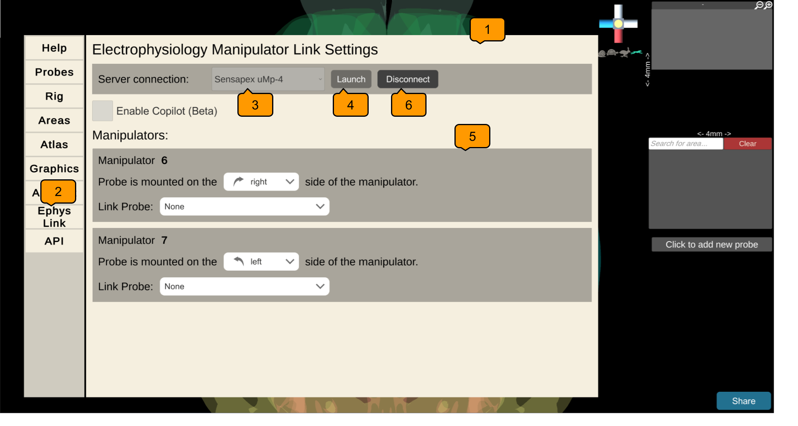
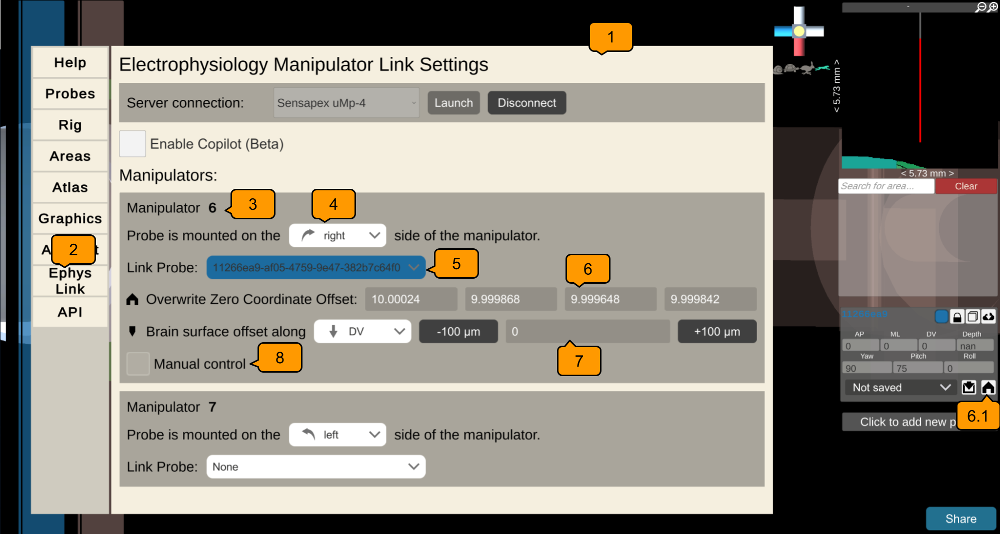
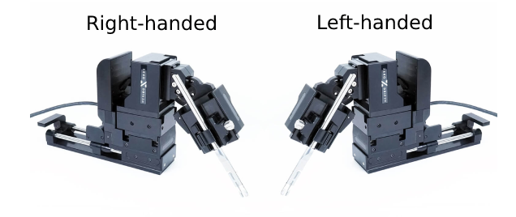

# Ephys Link

Pinpoint can be connected to electrophysiology manipulators
enabling experimenters to automate the placement of manipulators as well as
observe live where probes are placed inside the mouse brain.

**In this tutorial you will learn how to:**

1. [Configure and launch Ephys Link](configure-and-launch-ephys-link)
2. [Connect to the server from Pinpoint](ephys-link-connection)
3. [Mirror the positions of _in
   vivo_ probes in Pinpoint](ephys-link-mirror-probes)

[//]: # (**If you would like to use beta version of)

[//]: # (Ephys Link with Pinpoint, please use Steam to install Pinpoint and [switch to)

[//]: # (the `ephys-link-beta`branch]&#40;https://partner.steamgames.com/doc/store/application/branches#:~:text=To%20switch%20to%20a%20custom,be%20the%20%22BETAS%22%20tab&#41;)

[//]: # (.**)

[//]: # (To enable this feature, an instance of an Ephys Link server must be running on)

[//]: # (the local network. Please see the)

[//]: # (instructions [here]&#40;https://virtualbrainlab.org/ephys_link/installation_and_use.html#installation&#41;)

[//]: # (on how to install and run a server.)

[//]: # ()

[//]: # (
)

[//]: # (  <iframe src="https://www.youtube-nocookie.com/embed/QK87XBd46aQ?rel=0&modestbranding=1" style="position: absolute; top: 0; left: 0; width: 100%; height: 100%; border:0;" allowfullscreen title="Overview"></iframe>)

[//]: # (
)

[//]: # ( )

(configure-and-launch-ephys-link)=

## 1. Configure and Launch Ephys Link

### Install Ephys Link

First, install Ephys Link. Follow the instructions on
the [installation page](https://virtualbrainlab.org/ephys_link/installation_and_use.html#installation).
We recommend most users install
the [standalone executable](https://virtualbrainlab.org/ephys_link/installation_and_use.html#install-as-standalone-executable).

### Launch Ephys Link

With the executable downloaded, simply double-click the executable file to
launch
the configuration window.

### Configuring Ephys Link

You can configure the server using the configuration window. All changes are
preserved for future launches.

- **Serving Settings**
    - **IP:** the local IP address of the computer running the server. If
      Pinpoint
      is running on the same computer as Ephys Link, `localhost` will work as
      the IP. Otherwise, copy this address to Pinpoint.
    - **Port:** the port number that the server will listen on. Also copy this
      to
      Pinpoint.
- **Platform Type:** Select the appropriate manipulator platform for your setup.
- **Pathfinder Settings:** If you are using New Scale's Pathfinder MPM Control
  software to control your manipulators, please enable the HTTP server and
  specify the port number here (it should be 8080 by default).
- **Emergency Stop Settings:** If you are using the Arduino hardware stop
  button, please specify the serial port. An empty value will be used to
  automatically detect the port and a value of `no-e-stop` will disable this
  feature.

Press "Launch Server" to save your configuration and start the server. The
configuration window will close and the server will use the console window.

(ephys-link-connection)=

## 2. Connect to Ephys Link from Pinpoint

1. Press <kbd>ESC</kbd> to open the settings menu
2. Switch to the "Ephys Link" tab
3. Fill in the server's IP address
4. And the port number
5. Click "Connect". Upon success, the connect button will read "Disconnect"
6. Panels for each manipulator will appear here. These panels allow for the
   configuration of manipulators and linking them to probes in the scene.
7. Press <kbd>ESC</kbd> again to close the settings menu

(ephys-link-mirror-probes)=

## 3. Mirror the Positions of _in vivo_ Probes in Pinpoint

This step is not required for New Scale Pathfinder MPM connections. [See below
for details](mpm-no-need-config).

1. Spawn the corresponding probe in the planner scene.
2. Press <kbd>ESC</kbd> to open the settings menu.
3. Switch to the "Ephys Link" tab.
4. Scroll down to the panel that represents the _in vivo_ manipulator.
5. Use the dropdown to configure the manipulator's handedness. As of July
   2023 configuration is necessary for Sensapex uMp manipulators only.
   Configuration is hidden for New Scale manipulators. See the section below for
   more information.
6. Use the dropdown to select a probe to link to this manipulator. Probes are
   identified by their unique ID (UUID) and their color in the scene.
7. Upon connection, the probe's stereotaxic position will be used as the zero
   coordinate that all movements will be relative to. This zero coordinate can
   be edited manually through the text boxes or by clicking the home button to
   reset the position to the current probe position.
8. The probe's offset from the brain surface and which direction it is
   calculated can be adjusted here. The offset is the distance from the probe
   tip to the brain surface. This offset can be determined as the distance from
   the tip to the brain surface along the DV axis or the probe's depth axis.
9. Manual control of the manipulators can be enabled here. This allows
   manipulators to be controlled with
   the [same keyboard shortcuts](https://virtualbrainlab.org/pinpoint/tutorial.html#keyboard)
   used to move probes in the planner around. Manipulators can also be driven
   back to their zero coordinate.
10. Press <kbd>ESC</kbd> again to close the settings menu.

At this point, the _in vivo_ probe positions should be mirrored in Pinpoint in
real time.

### Sensapex Handedness

Handedness determines the orientation of the manipulator and which
direction it moves. Handedness is classified by which side of the
manipulator the probe will be mounted on. Ephys Link will use this to correctly
orient the manipulator's direction.

Below is a diagram of the handedness of Sensapex manipulators. Use this to
determine the handedness of your manipulator.

(mpm-no-need-config)=

### New Scale Pathfinder MPM connections do not require configuration

Launching Ephys Link requires specifying the type of manipulator that is being
used. Configuration in Pinpoint will differ depending on the type of
manipulator. **New Scale Pathfinder connections do not require any
configuration** in Pinpoint as all manipulators are configured in Pathfinder.
Pinpoint will automatically create probes (colored in magenta) for
each manipulator from Pathfinder and automatically echo their positions,
angles, and shank count.

## Enabling experiment automation (Ephys Copilot)

Automation is currently a beta feature that is still in development.
Please [contact](https://virtualbrainlab.org/about/overview.html) Dan or Kenneth
if you would like to try it out.