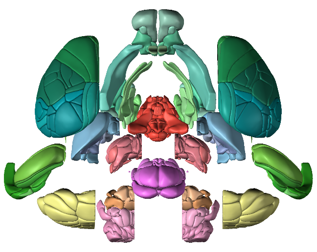
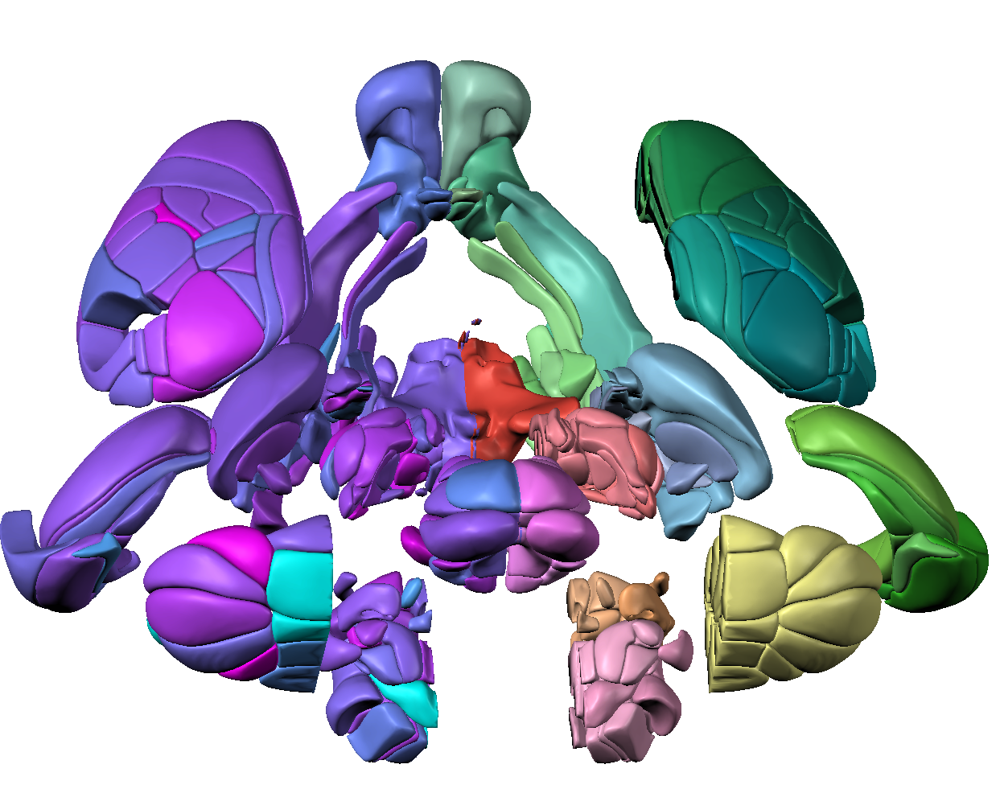

# Installation and Use

<p float="left">
  
  
 
</p>

<p float="center">
  
</p>

The Universal Renderer for Neuroscience (Urchin) allows you to connect your Python scripts to a standalone rendering program, to create graphics like the ones above.

<div style="padding: 15px; border: 1px solid transparent; border-color: transparent; margin-bottom: 20px; border-radius: 4px; color: #31708f; background-color: #d9edf7; border-color: #bce8f1;">
<p>Pinpoint and Urchin will be at SfN 2023!</p>
<p><b>Sunday Nov 12th 6:30pm-9pm</b> we'll be at the <i>Tools, Tech and Theory: BRAIN Initiative Alliance Social</i> Renaissance Washington, DC Downtown Hotel, Potomac Ballroom Salon 2.</p>
<p><b>Tuesday Nov 14th 1pm-5pm</b> we'll be at poster 446.21 and 446.22</p>
</div>

## Install

```
pip install oursin
```

No additional installation is required if you plan to run Urchin in a browser. A standalone desktop application is also available from the [releases page](https://github.com/dbirman/UnityNeuroscience/releases). Linux standalone available on request.

## Instructions

```
import oursin as urchin
urchin.setup()
```

Calling `setup()` opens a web browser and links it to your Python client.

Set the parameter `standalone = True` to connect to a standalone Desktop application. You'll need to manually copy the ID that Urchin displays to the Desktop renderer.

## Citing

There is no citation for Urchin right now, we'll create one soon.
